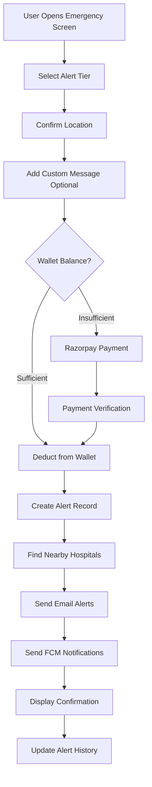

# Élan 🫀
## Emergency Cardiac Care System

---

# 📋 Project Overview

**Élan** is a comprehensive **Emergency Cardiac Care System** designed to provide rapid response and coordination during cardiac emergencies. The application connects patients with nearby hospitals through an intelligent alert system, ensuring timely medical intervention.

### 🎯 Mission Statement
> *"Bridging the critical gap between cardiac emergencies and medical response through technology"*

---

# 🏗️ System Architecture

```
┌─────────────────────────────────────────────────────────────┐
│                      Élan Ecosystem                      │
├─────────────────────────────────────────────────────────────┤
│                                                             │
│   ┌─────────────┐         ┌─────────────┐                  │
│   │   Flutter   │ ◄─────► │   Node.js   │                  │
│   │  Mobile App │   REST  │   Backend   │                  │
│   └─────────────┘   API   └──────┬──────┘                  │
│         │                        │                         │
│         │                        ▼                         │
│         │               ┌─────────────────┐                │
│         │               │   Firebase FCM  │                │
│         │               │  (Push Notifs)  │                │
│         │               └────────┬────────┘                │
│         │                        │                         │
│         ▼                        ▼                         │
│   ┌─────────────┐       ┌─────────────────┐               │
│   │  Razorpay   │       │    Hospitals    │               │
│   │  Payments   │       │  (Email Alerts) │               │
│   └─────────────┘       └─────────────────┘               │
│                                                             │
└─────────────────────────────────────────────────────────────┘
```

---

# 🛠️ Technology Stack

## Frontend (Mobile Application)
| Technology | Purpose |
|------------|---------|
| **Flutter** | Cross-platform mobile development |
| **Dart** | Programming language |
| **Geolocator** | GPS location services |
| **Razorpay Flutter** | Payment integration |
| **Shared Preferences** | Local data storage |

## Backend (Server)
| Technology | Purpose |
|------------|---------|
| **Node.js** | Server runtime |
| **Express.js** | REST API framework |
| **Firebase Admin** | Push notifications (FCM) |
| **bcryptjs** | Password encryption |
| **JSON Web Token** | Authentication |
| **Axios** | HTTP client |

---

# 📱 Application Screens

## 1️⃣ Splash Screen
- Animated logo presentation
- Auto-login functionality check
- Smooth transitions to authentication

## 2️⃣ Authentication Screens
### Sign Up Screen
- Name, Email, Password fields
- Password confirmation
- Form validation
- Beautiful glassmorphic design

### Login Screen
- Email & Password authentication
- Location permission request
- Remember me functionality

---

## 3️⃣ Dashboard
The central hub of the application featuring:

| Card | Function | Icon |
|------|----------|------|
| **Emergency Alert** | Send SOS to hospitals | 🚨 |
| **Vital Monitoring** | Track patient vitals | ❤️ |
| **Patient Records** | View patient history | 📋 |
| **Medical Reports** | Access medical documents | 📊 |
| **Hospital Alerts** | View sent alert history | 🏥 |

---

## 4️⃣ Emergency Screen
The core feature of Élan:

### Alert Tier System
| Tier | Cost | Hospitals Notified |
|------|------|-------------------|
| **Tier 1** | ₹1 | 1 nearest hospital |
| **Tier 2** | ₹2 | 3 nearest hospitals |
| **Tier 3** | ₹3 | All nearby (up to 10) |

### Features:
- 📍 Real-time GPS location tracking
- 💰 Digital wallet for quick payments
- 📝 Custom emergency message
- 🏥 Automatic hospital selection by proximity

---

## 5️⃣ Monitoring Screen
Real-time vital signs monitoring:

- **Heart Rate** (BPM)
- **Blood Pressure** (mmHg)
- **Oxygen Saturation** (SpO2)
- **Temperature** (°C)
- **Respiratory Rate** (breaths/min)

Visual indicators show abnormal readings with color coding:
- 🟢 Green: Normal
- 🟡 Yellow: Warning
- 🔴 Red: Critical

---

## 6️⃣ Patient Records Screen
Comprehensive patient information:

- Patient demographics
- Medical conditions
- Emergency contacts
- Allergy information
- Medication history
- Condition status (Critical/Stable/Recovering)

---

## 7️⃣ Reports Screen
Access to medical documentation:

- Diagnostic reports
- Lab results
- Imaging reports
- Doctor notes
- Treatment summaries

---

## 8️⃣ Hospital Alert History
Track all emergency alerts sent:

- Alert timestamp
- Tier level used
- Hospitals contacted
- Response status
- Location data

---

# 🔌 API Endpoints

## Authentication
| Method | Endpoint | Description | Auth |
|--------|----------|-------------|------|
| `POST` | `/api/auth/register` | Register new user | ❌ |
| `POST` | `/api/auth/login` | Login user | ❌ |
| `POST` | `/api/auth/location` | Update location | ✅ |

## Hospitals
| Method | Endpoint | Description | Auth |
|--------|----------|-------------|------|
| `GET` | `/api/hospitals/nearby` | Find nearby hospitals | ❌ |

## Payments
| Method | Endpoint | Description | Auth |
|--------|----------|-------------|------|
| `POST` | `/api/payments/create-order` | Create payment | ✅ |
| `POST` | `/api/payments/verify` | Verify payment | ✅ |

## Alerts
| Method | Endpoint | Description | Auth |
|--------|----------|-------------|------|
| `POST` | `/api/alerts/send` | Send emergency | ✅ |
| `GET` | `/api/alerts/history` | Get history | ✅ |

---

# 🏥 Hospital Network

Currently configured hospitals near **Shravanabelagola, Karnataka**:

1. **Bahubali Children Hospital**
   - SH-8, Chalya Post, Shravanabelagola

2. **Shravanabelagola Government Hospital**
   - Shravanabelagola Main Road

3. **Swayam Sevak Nagara Hospital**
   - Shravanabelagola area

4. **Primary Health Centre (PHC) - Chalya**
   - Chalya/Nirisare Road

---

# 🎨 UI/UX Design Principles

## Design Theme
- **Premium dark mode** interface
- **Glassmorphic** card effects
- **Gradient accents** (Red to Pink for cardiac theme)
- **Smooth animations** throughout

## Responsive Design
| Device Type | Screen Width |
|-------------|--------------|
| Mobile | < 600px |
| Tablet | 600px - 1200px |
| Desktop | > 1200px |

## Color Palette
```
Primary:     #FF1744 (Red 500)
Secondary:   #FF4081 (Pink Accent)
Background:  #121212 (Dark Grey)
Surface:     #1E1E1E (Elevated Dark)
Success:     #4CAF50 (Green)
Warning:     #FFC107 (Amber)
Error:       #F44336 (Red)
```

---

# 🔐 Security Features

1. **JWT Authentication**
   - Secure token-based auth
   - Token expiry management

2. **Password Security**
   - bcrypt hashing (10 rounds)
   - Minimum 6 character requirement

3. **API Security**
   - Bearer token authentication
   - Protected endpoints
   - CORS enabled

4. **Data Privacy**
   - Local encrypted storage
   - Secure preferences

---

# 🚀 Emergency Alert Flow



---

# 📊 Data Models

## User Model
```dart
class User {
  String id;
  String name;
  String email;
  double? latitude;
  double? longitude;
}
```

## Hospital Model
```dart
class Hospital {
  String id;
  String name;
  String address;
  String phone;
  String emergencyEmail;
  double latitude;
  double longitude;
}
```

## Patient Record
```dart
class PatientRecord {
  String id;
  String name;
  int age;
  String gender;
  String bloodType;
  String condition;
  String emergencyContact;
  String lastCheckup;
  List<String> allergies;
  List<String> medications;
}
```

---

# 📈 Future Enhancements

## Phase 2 Features
- [ ] Real-time hospital response tracking
- [ ] Ambulance GPS tracking
- [ ] Video call with doctors
- [ ] Wearable device integration

## Phase 3 Features
- [ ] AI-based symptom analysis
- [ ] Predictive cardiac risk assessment
- [ ] Multi-language support
- [ ] Offline emergency mode

## Phase 4 Features
- [ ] Hospital dashboard portal
- [ ] Analytics and reporting
- [ ] Insurance integration
- [ ] Telemedicine consultations

---

# 🔧 Installation & Setup

## Prerequisites
- Flutter SDK (>=3.0.0)
- Node.js (>=16.0.0)
- Android Studio / Xcode
- Firebase account

## Quick Start

### Backend Setup
```bash
cd backend
npm install
cp .env.example .env
# Configure environment variables
npm start
```

### Flutter App Setup
```bash
flutter pub get
flutter run
```

---

# 👥 Team

| Role | Responsibility |
|------|---------------|
| **Developer** | Full-stack development |
| **Designer** | UI/UX design |
| **Tester** | Quality assurance |

---

# 📞 Emergency Use Case

### Scenario: Cardiac Emergency

1. **User Experience Symptoms**
   - Opens Élan app
   - Navigates to Emergency Screen

2. **Sends Alert**
   - Selects Tier 2 (3 hospitals)
   - App detects current location
   - Adds message: "Chest pain, difficulty breathing"

3. **Payment Processing**
   - ₹2 deducted from wallet
   - Alert created instantly

4. **Hospital Notification**
   - 3 nearest hospitals receive email
   - FCM push notification sent
   - Alert includes: Patient info, location, symptoms

5. **Response**
   - Hospitals prepare for patient
   - Ambulance dispatched
   - Patient receives confirmation

---

# 🏆 Key Differentiators

| Feature | Élan | Traditional |
|---------|-----------|-------------|
| Response Time | **< 30 seconds** | Minutes |
| Hospital Selection | **Automatic proximity** | Manual |
| Payment | **Digital wallet** | N/A |
| Location | **Real-time GPS** | Address lookup |
| Notifications | **Multi-channel** | Phone call only |
| History | **Digital records** | Paper-based |

---

# 📝 Summary

**Élan** is a comprehensive emergency cardiac care solution that:

✅ **Reduces** emergency response time  
✅ **Automates** hospital notification  
✅ **Provides** real-time location sharing  
✅ **Enables** tiered alert system for flexibility  
✅ **Maintains** digital records of all emergencies  
✅ **Integrates** payment processing seamlessly  

### Vision
> *"Every second counts in a cardiac emergency. Élan ensures those seconds are never wasted."*

---

# 🙏 Thank You

## Questions?

**Élan** - *Emergency Cardiac Care System*

---

*Version 1.0.0 | Built with Flutter & Node.js*
